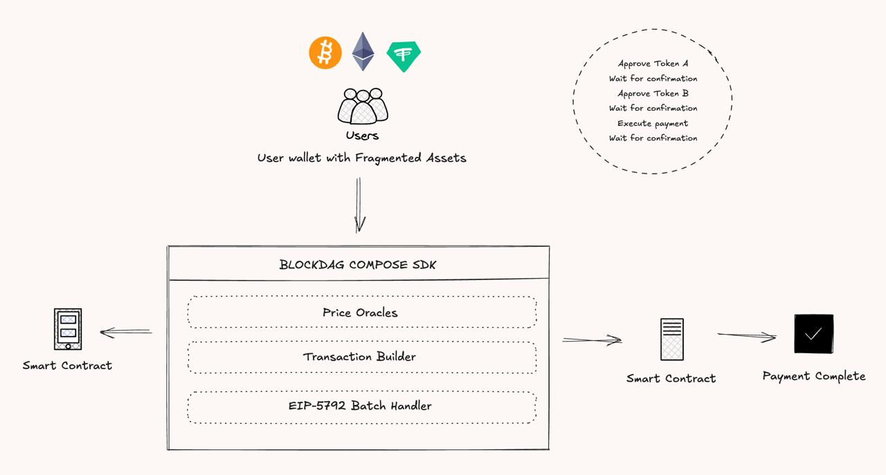

# BlockDAG Compose SDK

> **Status:** 🚀 Ideation & Architecture Design Phase

**Multi-asset payments for Bitcoin DeFi - Simplifying fragmented wallet experiences**

---

## 💡 The Vision

Imagine you're buying an NFT for $1,000, but your funds are fragmented:
- $300 in BTC
- $400 in BUSD  
- $350 in bUSDC

The seller wants payment in a single token. Now you're stuck:
1. Approve Token A → Wait for confirmation
2. Approve Token B → Wait for confirmation  
3. Swap everything to one asset → Lose value to slippage
4. Execute payment → Wait again
5. Frustrated user experience → Abandoned cart

**What if you could pay with any combination of tokens in a single transaction?**

---

## 🎯 The Problem We're Solving

### Current State (Web3 Checkout Hell)
- Users must hold specific tokens to make purchases
- Fragmented balances across multiple assets can't be combined easily
- Each approval and swap requires separate transactions and confirmations
- High gas fees, slippage losses, and poor UX
- Abandoned transactions due to complexity

### Desired State (Seamless Multi-Asset Payments)
- Users pay with any combination of tokens they own
- Single-signature, atomic execution of approvals + payment
- Real-time USD valuation across all assets
- No forced swaps, minimal friction
- Web2-like checkout experience in Web3

---

## 🏗️ System Architecture



### Core Components

#### 1️⃣ **User Layer**
- Users with fragmented assets (BTC, BUSD, stablecoins)
- Single wallet interface for multi-asset allocation
- Real-time balance visibility with USD valuations

#### 2️⃣ **BlockDAG Compose SDK** (The Orchestration Layer)

The SDK coordinates three essential subsystems:

**🔮 Price Oracles**
- Skip Connect Oracle for BTC/USD pricing
- Pyth Network for stablecoin feeds (BUSD, bUSDC, bUSDT)
- Real-time price updates normalized to consistent decimals
- Fallback mechanisms for oracle reliability

**🔨 Transaction Builder**
- Generates optimized ERC20 approval calldata
- Constructs multi-asset payment transactions
- Encodes amounts with proper decimal handling
- Optional swap routing through BlockDAG Pools (Tigris DEX)

**⚡ EIP-5792 Batch Handler**
- Atomic batching of approvals + payment call
- Single signature for entire transaction flow
- Automatic fallback to sequential mode for non-supporting networks
- Reduces gas costs and eliminates confirmation waiting

#### 3️⃣ **Smart Contract Layer**
- On-chain settlement via `BlockDAGCompose` contract
- Multi-token reception in a single atomic operation
- Integration hooks for marketplaces, protocols, and dApps
- Emergency recovery mechanisms

#### 4️⃣ **Outcome**
- ✅ Payment complete in one user action
- ✅ No manual swaps or multiple confirmations
- ✅ Optimized gas usage
- ✅ Seamless user experience

---

## 🎨 User Experience Flow

### Traditional Flow (Without SDK)
```
┌──────────────────────────────────────────────────────────┐
│                                                          │
│  1. Realize you need Token X                            │
│  2. Approve Token A → Sign & Wait ⏳                     │
│  3. Approve Token B → Sign & Wait ⏳                     │
│  4. Swap A to X on DEX → Sign & Wait ⏳                  │
│  5. Swap B to X on DEX → Sign & Wait ⏳                  │
│  6. Finally execute payment → Sign & Wait ⏳             │
│                                                          │
│  Result: 5 transactions, ~15-20 minutes, high fees 💸   │
│                                                          │
└──────────────────────────────────────────────────────────┘
```

### With BlockDAG Compose SDK
```
┌──────────────────────────────────────────────────────────┐
│                                                          │
│  1. See all balances valued in real-time USD            │
│  2. Drag sliders to allocate BTC + BUSD + bUSDC         │
│  3. Click "Pay" → Sign once ✍️                          │
│  4. Done ✅                                              │
│                                                          │
│  Result: 1 signature, 30 seconds, minimal fees 🎉       │
│                                                          │
└──────────────────────────────────────────────────────────┘
```

---

## 🛠️ Technical Architecture

### Stack Components

**Frontend SDK**
- React + TypeScript for UI components
- Viem + Wagmi for Ethereum interactions
- RainbowKit for wallet connectivity
- Real-time hooks for prices and balances

**Oracle Integration**
- Skip Connect (Chainlink-compatible) for BTC pricing on BlockDAG
- Pyth Network for low-latency stablecoin feeds
- Price normalization layer for consistent decimal handling

**Transaction Layer**
- EIP-5792 atomic batch execution (when supported)
- Sequential fallback mode for compatibility
- Gas optimization through call batching
- Dynamic approval amounts based on user allocation

**Smart Contracts**
- `BlockDAGCompose.sol` - Multi-asset payment receiver
- `BlockDAGRouter.sol` - Optional swap integration
- Emergency withdrawal mechanisms
- Owner controls for protocol upgrades

**Supported Networks** (Planned)
- ✅ BlockDAG Testnet (Chain ID: 31611) - Primary target
- 🔜 BlockDAG Mainnet
- 🔜 Bitcoin L2s with EVM compatibility

### Supported Assets (Initial Phase)

| Asset | Symbol | Use Case | Oracle Source |
|-------|--------|----------|---------------|
| Bitcoin | BTC | Primary DeFi asset on BlockDAG | Skip Connect |
| BlockDAG USD | BUSD | Bitcoin-backed stablecoin | Pyth Network |
| Bridged USDC | bUSDC | Liquidity bridge | Pyth Network |
| Bridged USDT | bUSDT | Liquidity bridge | Pyth Network |

---

## 📋 Development Roadmap

### Phase 1: Foundation (Current - Ideation)
- [x] Architecture design
- [x] Technical specification
- [x] Component breakdown
- [ ] Smart contract design review
- [ ] Security considerations documentation

### Phase 2: Prototype Development
- [ ] Core SDK implementation
  - [ ] Oracle service layer
  - [ ] Transaction builder utilities
  - [ ] EIP-5792 batch handler
- [ ] Smart contract development
  - [ ] BlockDAGCompose contract
  - [ ] Test suite
  - [ ] Gas optimization
- [ ] React component library
  - [ ] `<Assets />` main UI
  - [ ] Price/balance hooks
  - [ ] Allocation interface

### Phase 3: Testing & Security
- [ ] Unit test coverage (>90%)
- [ ] Integration testing with testnet
- [ ] Smart contract audit
- [ ] Oracle reliability testing
- [ ] Gas benchmarking
- [ ] Security review

### Phase 4: Deployment & Integration
- [ ] BlockDAG Testnet deployment
- [ ] Demo application (NFT marketplace example)
- [ ] SDK npm package publishing
- [ ] Developer documentation
- [ ] Integration guides

### Phase 5: Mainnet & Scaling
- [ ] Mainnet deployment
- [ ] Additional asset support
- [ ] Cross-chain compatibility
- [ ] Partner integrations
- [ ] Community SDK extensions

---

## 🎯 Use Cases

### **NFT Marketplaces**
Buyers pay for NFTs using any combination of tokens they own. No more "sorry, we only accept ETH" limitations.

### **DeFi Protocols**
Accept deposits and collateral in multiple assets simultaneously. Users don't need to swap before interacting with your protocol.

### **Gaming Economies**
In-game purchases with fragmented balances. Players use whatever tokens they've earned across different games.

### **E-Commerce & Payments**
Web3 checkouts that feel like Web2. Accept any asset, provide a unified USD checkout experience.

### **DAO Treasury Management**
Multi-asset funding rounds and contributions. Contributors use their preferred tokens without coordination overhead.

---

## 💻 Proposed Developer Experience

### Quick Integration Example

```tsx
import { BlockDAGOracleService, BLOCKDAG_TESTNET_CONFIG, Assets } from 'blockdag-compose-sdk';
import { useAccount, useChainId } from 'wagmi';

function Checkout() {
  const { address, isConnected } = useAccount();
  const chainId = useChainId();
  const service = new BlockDAGOracleService(BLOCKDAG_TESTNET_CONFIG);
  
  const wallet = { address, isConnected, chainId };
  
  return (
    <Assets
      service={service}
      wallet={wallet}
      targetAmount={1000} // $1,000 purchase
      onPurchase={(payload) => {
        console.log('User allocated:', payload.items);
        // Execute your payment logic
      }}
    />
  );
}
```

### Hook-Based Approach

```tsx
import { usePrices, useBalances, BlockDAGOracleService } from 'blockdag-compose-sdk';

function CustomCheckout() {
  const service = new BlockDAGOracleService(BLOCKDAG_TESTNET_CONFIG);
  const { prices, loading } = usePrices(service);
  const { balances } = useBalances(service, wallet);
  
  // Build custom UI with real-time data
  return (
    <div>
      <p>BTC: ${(Number(prices.btcUsd) / 1e8).toFixed(2)}</p>
      <p>Your Balance: {(Number(balances.btc) / 1e18).toFixed(6)} BTC</p>
    </div>
  );
}
```

### Transaction Building

```tsx
import { buildAllocateBatchTransaction } from 'blockdag-compose-sdk';

const handlePayment = async (payload) => {
  // Get all transactions (approvals + payment)
  const txs = buildAllocateBatchTransaction(payload.items, chainId);
  
  // Execute atomically with EIP-5792 or sequentially
  await executeBatchCalls(walletClient, txs, {
    onSuccess: (hash) => console.log('Payment complete:', hash),
    onFallback: () => console.log('Using sequential mode'),
  });
};
```

---

## 🔍 Key Technical Considerations

### Gas Optimization
- Batch approvals to reduce transaction count
- Optimized calldata encoding
- Minimal on-chain storage requirements
- EIP-5792 reduces gas by ~40% vs sequential

### Oracle Reliability
- Multiple price feed sources
- Staleness checks and circuit breakers
- Fallback pricing mechanisms
- Price deviation alerts

### Security
- Smart contract audit before mainnet
- No custody of user funds
- Reentrancy guards
- Emergency pause mechanisms
- Owner-only withdrawal functions

### Compatibility
- Works with any ERC20 token
- EIP-5792 with automatic fallback
- MetaMask, Rainbow, Coinbase Wallet support
- Mobile wallet compatibility

---

## 🤝 Target Audience

**For Users:**
- DeFi participants with fragmented portfolios
- NFT collectors and traders
- Web3 gamers with cross-game tokens
- Anyone tired of swapping before every transaction

**For Developers:**
- NFT marketplace builders
- DeFi protocol teams
- Gaming studios building web3 economies
- E-commerce platforms accepting crypto
- DAO infrastructure developers

---

## 📊 Expected Impact

### User Experience Metrics
- **Transaction Time:** 15-20 min → 30 seconds (97% reduction)
- **Signatures Required:** 5-6 → 1 (83% reduction)
- **Gas Costs:** Reduced by ~40% with batch execution
- **Checkout Abandonment:** Expected 30-40% reduction

### Developer Benefits
- Drop-in React components
- 5 lines of code for basic integration
- No backend infrastructure required
- Free oracle data access
- Open source and extensible

---

## 📁 Proposed Project Structure

```
blockdag-compose-sdk/
├── src/
│   ├── components/          # React UI components
│   │   ├── Assets.tsx       # Main allocation UI
│   │   └── ErrorBoundary.tsx
│   ├── hooks/               # React hooks
│   │   ├── usePrices.ts     # Real-time oracle prices
│   │   ├── useBalances.ts   # User token balances
│   │   └── useAssetData.ts  # Combined allocation state
│   ├── services/            # Data fetching services
│   │   ├── BlockDAGOracleService.ts   # Skip + Pyth integration
│   │   └── BlockDAGSwapService.ts     # Tigris DEX routing
│   ├── contracts/           # ABIs and addresses
│   │   ├── BlockDAGCompose.ts
│   │   └── BlockDAGRouter.ts
│   ├── utils/               # Core utilities
│   │   ├── transactionBuilder.ts  # TX encoding
│   │   ├── formatters.ts          # Display formatting
│   │   ├── calculations.ts        # USD conversions
│   │   └── batchCalls.ts          # EIP-5792 handler
│   ├── config/              # Network configs
│   │   ├── assets.ts        # Token definitions
│   │   └── networks.ts      # Chain parameters
│   └── types/               # TypeScript definitions
│       ├── index.ts
│       ├── wallet.ts
│       └── transaction.ts
├── contracts/               # Solidity contracts
│   ├── BlockDAGCompose.sol
│   └── interfaces/
├── test/                    # Test suites
├── docs/                    # Documentation
└── examples/                # Integration examples
```

---

## 🔐 Security Considerations

### Smart Contract Security
- [ ] Reentrancy protection
- [ ] Integer overflow/underflow checks (Solidity 0.8+)
- [ ] Access control mechanisms
- [ ] Emergency pause functionality
- [ ] Formal verification of critical paths
- [ ] Third-party security audit

### Oracle Security
- [ ] Price feed staleness checks
- [ ] Deviation threshold monitoring
- [ ] Multi-source aggregation
- [ ] Circuit breakers for extreme volatility

### Frontend Security
- [ ] Input validation and sanitization
- [ ] Safe decimal handling (no floating point math)
- [ ] Transaction simulation before execution
- [ ] Clear user confirmation UI

---

## 🌟 Competitive Advantages

| Feature | Traditional Approach | BlockDAG Compose |
|---------|---------------------|------------------|
| **Multi-asset payments** | ❌ Manual swaps required | ✅ Native support |
| **Transaction count** | 5-6 separate TXs | 1 atomic batch |
| **User signatures** | Multiple approvals | Single signature |
| **Gas optimization** | High cumulative gas | 40% reduction |
| **Real-time pricing** | Manual calculation | Automatic USD view |
| **Developer integration** | Complex custom logic | Drop-in component |
| **EIP-5792 support** | Not standard | Built-in with fallback |

---

## 📚 Resources & References

### Technical Standards
- [EIP-5792: Wallet Call API](https://eips.ethereum.org/EIPS/eip-5792) - Atomic batch transactions
- [EIP-20: Token Standard](https://eips.ethereum.org/EIPS/eip-20) - ERC20 interface
- [Pyth Network](https://pyth.network/) - Cross-chain price oracles
- [Skip Connect](https://skip.build/) - BlockDAG-native BTC oracle

### BlockDAG Network
- [BlockDAG Documentation](https://blockdag.network/docs)
- [BlockDAG Testnet Explorer](https://explorer.test.blockdag.network)
- [BlockDAG Pools (Tigris DEX)](https://docs.tigris.io/)

---

## 👥 Team & Contributors

**Project Status:** Seeking collaborators and early adopters

Interested in contributing? Areas we're exploring:
- Smart contract development & auditing
- Oracle integration & reliability
- React SDK development
- UX/UI design for allocation interface
- Documentation & developer relations

---

## 📄 License

MIT License - Open source and free to use

---

## 🚀 Get Involved

This project is in the **ideation phase**. We're gathering feedback from:
- DeFi protocol developers
- NFT marketplace teams
- Wallet providers
- Oracle infrastructure projects
- Security researchers

**Questions or feedback?** Open an issue or start a discussion!

---

<div align="center">

**BlockDAG Compose SDK**  
*Simplifying multi-asset payments for Bitcoin DeFi*

[📖 Documentation](#) • [🎮 Demo](#) • [💬 Discord](#) • [🐦 Twitter](#)

</div>
